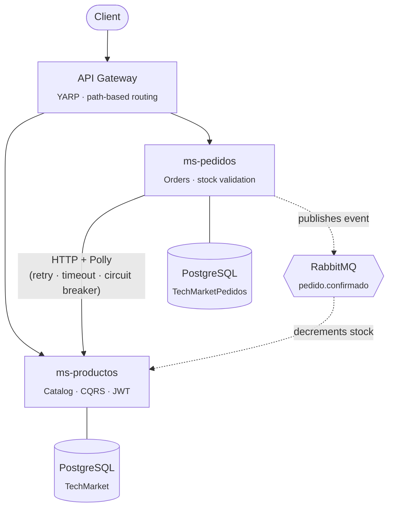
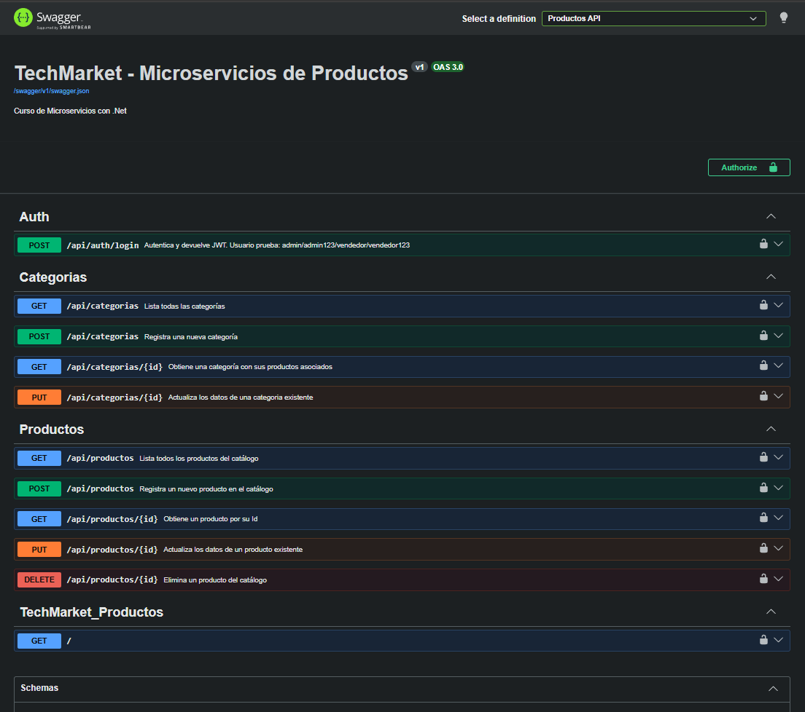
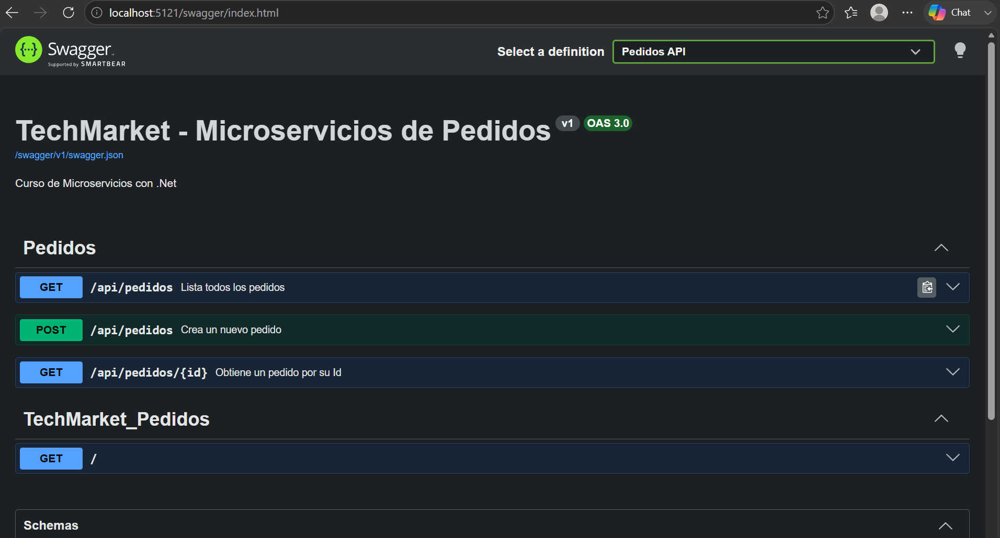
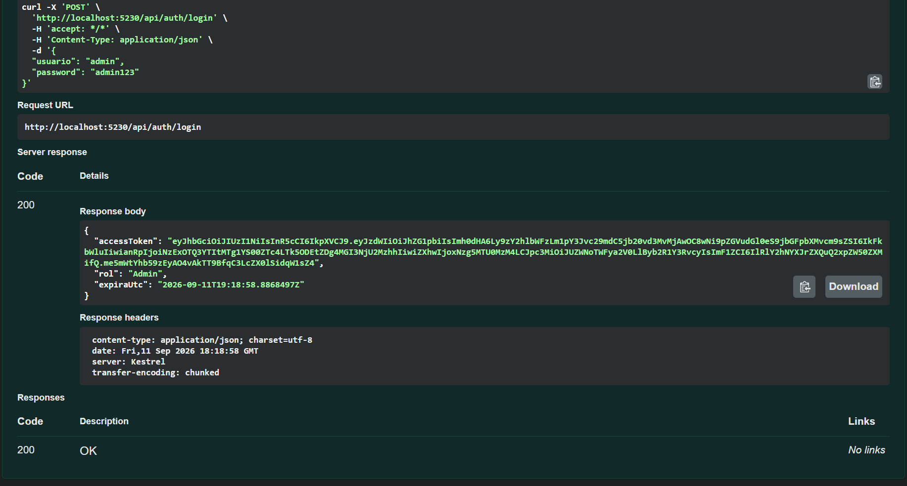
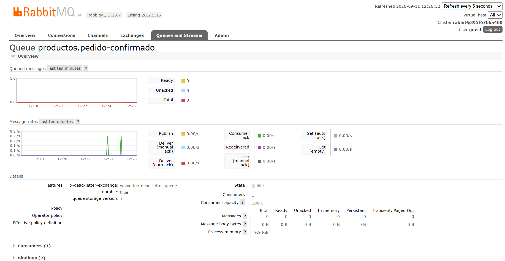

🇪🇸 [Español](README.md)&nbsp;|&nbsp;🇬🇧 English

# TechMarket — .NET Microservices Platform

An e-commerce system built as a **hands-on microservices architecture project** in .NET 10, incrementally applying synchronous and asynchronous communication patterns, security, resilience, and containerization — not a copied tutorial, but a system debugged and fixed piece by piece until it actually worked end-to-end.

     

*Service and database names below (`ms-pedidos`, `TechMarketPedidos`, etc.) are kept as-is from the actual codebase — "pedidos" is Spanish for "orders".*

## At a glance

- 3 independent microservices, each owning its own database
- **Synchronous** (HTTP + Polly) and **asynchronous** (RabbitMQ) communication, chosen per use case rather than forcing a single strategy everywhere
- CQRS with Wolverine, JWT authentication with role-based authorization, and an API Gateway as the single entry point
- The entire system spins up with one command: `docker-compose up`

## Architecture



Each microservice owns its own database — none of them accesses another's tables directly. Communication between them combines **two strategies depending on the actual need**: synchronous (HTTP) when the orders service needs an immediate response to validate stock, and asynchronous (events) when the products service only needs to eventually find out that an order was confirmed.

## Microservices

| Service | Responsibility | Port |
|---|---|---|
| **ms-gateway** | Single entry point; routes requests to the corresponding microservice | `5029` |
| **ms-productos** (Products) | Product and category catalog; authentication and JWT issuance; consumer of order events | `5230` |
| **ms-pedidos** (Orders) | Order creation; stock validation against Products; event publisher | `5121` |

## Architecture & engineering decisions

Beyond the "what" was built, this is the "why" behind the key decisions:

- **Database per service**, not a shared database — each microservice exclusively owns its schema, avoiding the hidden coupling of a cross-domain JOIN.
- **CQRS with Wolverine** in the products module — explicit separation between Commands (writes) and Queries (reads), each with its own Handler, decoupling business logic from the HTTP endpoint that triggers it.
- **Real resilience, not just the happy path** — the HTTP client from the orders service to the products service implements Retry with exponential backoff and jitter, Timeout, and Circuit Breaker (Polly), deliberately tested by shutting down the dependent service to verify graceful degradation.
- **Layered authentication and authorization** — JWT with role claims, validated in the pipeline before any business logic runs; read operations are public, write operations are restricted by role policy (`RequireAuthorization`).
- **Asynchronous communication via events** — the orders service publishes a `pedido.confirmado` (order confirmed) event to RabbitMQ without waiting for a response; the products service consumes it to decrement stock, fully decoupling the availability of one service from the other.
- **Atomic database-level updates** — stock decrements are resolved with a single `UPDATE ... WHERE Stock >= @quantity` (EF Core `ExecuteUpdateAsync`), eliminating race conditions under concurrent writes instead of relying on separate in-memory reads and writes.
- **Decoupled messaging contracts** — events use `[MessageIdentity]` instead of sharing a C# type across projects, letting each microservice evolve its own copy of the contract without depending on the other's assembly.
- **Full containerization** — multi-stage Dockerfiles (SDK for build, lightweight runtime for the final image) and orchestration with Docker Compose; the entire system (Gateway, 2 microservices, PostgreSQL, RabbitMQ) spins up with a single command.
- **Secrets kept out of version control** — credentials and JWT signing keys parameterized via `.env` (never committed), with `appsettings.json` containing only safe placeholders.

## Tech stack

`.NET 10` · `ASP.NET Core Minimal APIs` · `Entity Framework Core` · `PostgreSQL` · `Wolverine` (CQRS + messaging) · `RabbitMQ` · `Polly` (resilience) · `YARP` (API Gateway) · `JWT Bearer` · `FluentValidation` · `Docker` / `Docker Compose`

## Running it locally

```bash
git clone https://github.com/iliana212/TechMarket.git
cd TechMarket

cp .env.example .env   # fill in your own values

docker-compose up -d --build
```

| Service | URL |
|---|---|
| API Gateway | http://localhost:5029 |
| Swagger — Products (ms-productos) | http://localhost:5230/swagger |
| Swagger — Orders (ms-pedidos) | http://localhost:5121/swagger |
| RabbitMQ Management | http://localhost:15672 |

## Screenshots

> Add your own screenshots to a `docs/screenshots/` folder in the repo and update the paths below — they'll render on GitHub as soon as the images are uploaded.

| Swagger — Products | Swagger — Orders |
|---|---|
|  |  |

| JWT Authentication | RabbitMQ Dashboard |
|---|---|
|  |  |

## Background

This repository documents the full path of a live .NET microservices course, session by session: from the first microservice with Minimal APIs and persistence, through resilient HTTP communication, CQRS, authentication, containerization, up to asynchronous messaging between services. Every layer was built, tested, and — when needed — debugged until its real runtime behavior was confirmed, not just its compilation.
