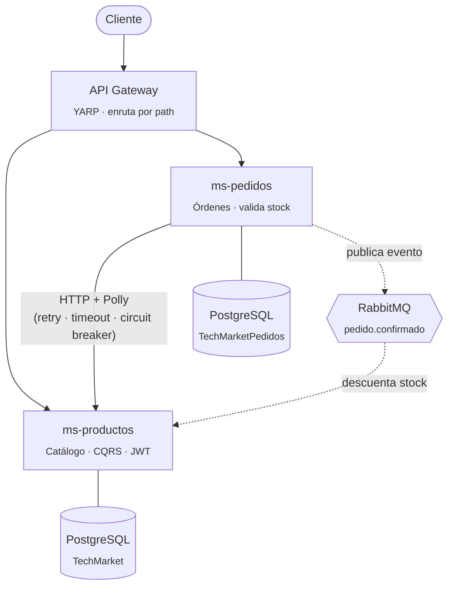

🇪🇸 Español&nbsp;|&nbsp;🇬🇧 [English](README.en.md)

# TechMarket — Plataforma de Microservicios en .NET

Sistema de e-commerce construido como **caso real de aprendizaje** de arquitectura de microservicios con .NET 10, aplicando de forma incremental patrones de comunicación síncrona y asíncrona, seguridad, resiliencia y contenerización — no un tutorial copiado, sino un sistema depurado y corregido pieza por pieza hasta dejarlo funcionando end-to-end.

     

## En un vistazo

- 3 microservicios independientes, cada uno con su propia base de datos
- Comunicación **síncrona** (HTTP + Polly) y **asíncrona** (RabbitMQ) según el caso de uso, no una sola estrategia forzada a todo
- CQRS con Wolverine, autenticación JWT con autorización por rol, y un API Gateway como único punto de entrada
- Todo el sistema se levanta con un solo comando: `docker-compose up`

## Arquitectura



Cada microservicio es dueño de su propia base de datos — ninguno accede directamente a las tablas del otro. La comunicación entre ellos combina **dos estrategias según la necesidad real**: síncrona (HTTP) cuando Pedidos necesita una respuesta inmediata para validar stock, y asíncrona (eventos) cuando Productos solo necesita enterarse eventualmente de que un pedido se confirmó.

## Microservicios

| Servicio | Responsabilidad | Puerto |
|---|---|---|
| **ms-gateway** | Punto de entrada único; enruta peticiones a los microservicios correspondientes | `5029` |
| **ms-productos** | Catálogo de productos y categorías; autenticación y emisión de JWT; consumidor de eventos de pedidos | `5230` |
| **ms-pedidos** | Creación de pedidos; validación de stock contra Productos; publicador de eventos | `5121` |

## Decisiones de arquitectura e ingeniería

Más allá del "qué" está construido, esto es el "por qué" detrás de las decisiones clave:

- **Base de datos por servicio**, no una base compartida — cada microservicio es dueño exclusivo de su esquema, evitando el acoplamiento oculto de un JOIN entre dominios distintos.
- **CQRS con Wolverine** en el módulo de Productos — separación explícita entre Commands (escritura) y Queries (lectura), cada uno con su propio Handler, desacoplando la lógica de negocio del endpoint HTTP que la dispara.
- **Resiliencia real, no solo happy path** — el cliente HTTP de Pedidos hacia Productos implementa Retry con backoff exponencial y jitter, Timeout, y Circuit Breaker (Polly), probado deliberadamente apagando el servicio dependiente para verificar la degradación controlada.
- **Autenticación y autorización por capas** — JWT con claims de rol, validado en el pipeline antes de que cualquier lógica de negocio se ejecute; operaciones de lectura públicas, operaciones de escritura restringidas por política de rol (`RequireAuthorization`).
- **Comunicación asíncrona vía eventos** — Pedidos publica `pedido.confirmado` a RabbitMQ sin esperar respuesta; Productos lo consume para descontar stock, desacoplando por completo la disponibilidad de un servicio de la del otro.
- **Actualizaciones atómicas a nivel de base de datos** — el descuento de stock se resuelve con un único `UPDATE ... WHERE Stock >= @cantidad` (EF Core `ExecuteUpdateAsync`), eliminando condiciones de carrera bajo escritura concurrente en vez de depender de lecturas y escrituras separadas en memoria.
- **Contratos de mensajería desacoplados** — los eventos usan `[MessageIdentity]` en vez de compartir un tipo de C# entre proyectos, permitiendo que cada microservicio evolucione su propia copia del contrato sin depender del ensamblado del otro.
- **Contenerización completa** — Dockerfiles multi-stage (build con SDK, runtime liviano en la imagen final) y orquestación con Docker Compose; todo el sistema (Gateway, 2 microservicios, PostgreSQL, RabbitMQ) se levanta con un solo comando.
- **Manejo de secretos fuera del control de versiones** — credenciales y claves de firma JWT parametrizadas vía `.env` (nunca commiteadas), con `appsettings.json` conteniendo solo placeholders seguros.

## Stack técnico

`.NET 10` · `ASP.NET Core Minimal APIs` · `Entity Framework Core` · `PostgreSQL` · `Wolverine` (CQRS + mensajería) · `RabbitMQ` · `Polly` (resiliencia) · `YARP` (API Gateway) · `JWT Bearer` · `FluentValidation` · `Docker` / `Docker Compose`

## Cómo correrlo localmente

```bash
git clone https://github.com/iliana212/TechMarket.git
cd TechMarket

cp .env.example .env   # completar con tus propios valores

docker-compose up -d --build
```

| Servicio | URL |
|---|---|
| API Gateway | http://localhost:5029 |
| Swagger — Productos | http://localhost:5230/swagger |
| Swagger — Pedidos | http://localhost:5121/swagger |
| RabbitMQ Management | http://localhost:15672 |

## Capturas

> Agrega tus propias capturas en una carpeta `docs/screenshots/` del repo y actualiza las rutas de abajo — quedan listas para renderizarse en GitHub en cuanto subas las imágenes.

| Swagger — Productos | Swagger — Pedidos |
|---|---|
|  |  |

| Autenticación JWT | Panel de RabbitMQ |
|---|---|
|  |  |

## Contexto

Este repositorio documenta el recorrido completo de un curso en vivo de microservicios con .NET, sesión por sesión: desde el primer microservicio con Minimal APIs y persistencia, pasando por comunicación HTTP resiliente, CQRS, autenticación, contenerización, hasta mensajería asíncrona entre servicios. Cada capa se construyó, se probó y —cuando fue necesario— se depuró hasta confirmar su comportamiento real en ejecución, no solo su compilación.
